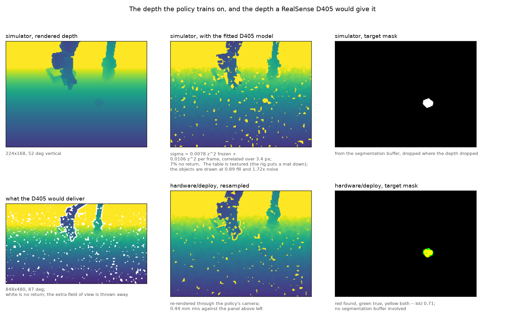

# The depth sensor, measured — and the pipeline that puts it on the robot

Two placeholders have been sitting in `src/piper_push/camera.py` since the
vision stage was built:

```python
# Depth sensor realism.  These are PLACEHOLDERS ...  guessing this is the
# single largest sim2real risk in the vision stage.
DEPTH_NOISE_M = 0.004
DEPTH_DROPOUT = 0.02
```

The camera has now been measured, the model has been fitted and installed, and
the deployment pipeline that feeds the policy from a real D405 has been written
and checked against the simulator. This is what came out.

Everything below is reproducible:

```bash
python hardware/depth_bench/model/fit_noise.py       # the fit
micromamba run -n mjlab python -m pytest tests -q    # the model reproduces it
micromamba run -n mjlab python -m hardware.deploy.selftest   # the pipeline
```

---

## 1. What the camera actually does

Measured on a printed ChArUco target with a blank white patch and a solid black
patch in the same frame, across 0.24–0.80 m, plus a 40-frame static capture of
a desk. Raw data and the fit are in `hardware/depth_bench/`.

### The error grows as the square of the range

Passive stereo recovers disparity and `z = fB/d`, so a fixed disparity error
becomes `sigma_z = z²/(fB) · sigma_d`. Fitted through the origin:

| surface | `a` in `sigma = a z²` | sigma at 0.70 m | fill | worst fill |
|---|---|---|---|---|
| printed pattern | 0.0203 | 9.9 mm | 99.6% | 98.4% |
| solid black | 0.0345 | 16.9 mm | 98.9% | 96.6% |
| blank white | 0.0405 | 19.9 mm | 88.1% | **41.9%** |

Fit residual 0.9 mm on the textured surface over ten distances.

The old constant, 4 mm, is right at 0.44 m on a textured surface. At the 0.70 m
this camera actually sits at it understates the error by 2.5×, and on a
featureless object by 5×.

### A third of it does not change between frames

Split on 40 static frames of one scene, patch by patch:

| | `a` | at 0.70 m | share of variance |
|---|---|---|---|
| static (fixed pattern) | 0.0078 | 3.8 mm | 35% |
| temporal (redrawn each frame) | 0.0106 | 5.2 mm | 65% |

Lag-1 temporal autocorrelation −0.007, i.e. the moving part is independent
frame to frame and the rest does not move at all. Stereo matches on whatever
texture is there; if the texture does not move, the disparity error does not
move either. **No amount of temporal filtering removes the static third**, and
a policy sees it as geometry.

### It is correlated across about eight sensor pixels

1/e of the autocorrelation at 8 px for the static component and 9 px for the
temporal, on the 848-wide native grid. This is why resampling to the policy's
224×168 buys almost nothing: the 2.7× downsample averages ~7 samples that are
already nearly the same sample. Assuming independence predicts a 2.7× noise
reduction that does not happen.

### It fails at depth discontinuities — which is where the object is

Fill rate against the local relative depth gradient, per radian so it transfers
across resolutions:

| gradient /rad | 0–0.9 | 0.9–2.2 | 2.2–4.3 | 4.3–8.6 | 8.6–21 | 21–43 | 43+ |
|---|---|---|---|---|---|---|---|
| fill | 0.97 | 0.96 | 0.87 | 0.75 | 0.65 | 0.46 | 0.31 |
| flickering | 0.20 | 0.19 | 0.48 | 0.62 | 0.78 | 0.98 | 1.00 |

Fitted as `p = 0.97 / (1 + (g/29.4)^0.99)`, RMS 0.024.

A 25–45 mm object at 0.7 m is almost entirely silhouette, so this is not an
edge case, it is the object. And at the steep end the pixels do not merely
vanish — they *flicker*, present one frame and gone the next, which is a much
harder thing for a recurrent policy to sit through than a steady hole.

### It reads short

`bias = −0.0131 z − 0.0054`, so about −14 mm at 0.70 m, residual 2.2 mm. A
per-unit calibration error rather than a property of the world, which is why
the simulator randomises it rather than applying it.

---

## 2. What changed in the simulator

`src/piper_push/depth_noise.py` implements the fit; `camera.DEPTH_NOISE` holds
it; `pick_place.mdp.CameraScene` applies it. Fifteen tests in
`tests/test_depth_noise.py` read the statistics back out of a simulated image
and compare them to the measurement — a noise model whose output does not have
the measured statistics is a decorative one, and the failure is invisible.

| | before | after |
|---|---|---|
| magnitude | 4 mm, constant | `a z²`, `a` drawn per surface from 0.013–0.028 |
| structure | independent per pixel | correlated over 3.4 policy pixels |
| persistence | independent per frame | 35% of the variance frozen per episode |
| dropout | 2% scattered uniformly | concentrated on depth discontinuities, in blobs |
| range bias | none | −1.3% and −5 mm, randomised ±2% and ±8 mm |
| surfaces | one for everything | the objects get the drawn quality; the table is textured, because the rig puts a mat down |
| the mask | exact | drops with the depth, boundary ±1 px |

Cost: **15–17% on the environment step** at 512 environments, of which 13.8 ms
is the corruption itself. Quoted as a ratio rather than as milliseconds
because the absolute number depends on what else is on the card: the same
measurement read 123 → 144 ms on an idle GPU and 198 → 228 ms with a training
job sharing it, and the ratio was 1.17 and 1.15.

Most of the first implementation's cost was one detail: writing the depth
gradient as a convolution with a difference kernel rather than as a
pad-and-slice is arithmetically identical and fifteen times slower, because
cuDNN has no good plan for one input channel and two output channels.

Two things the first implementation got wrong, both caught by putting the
model into the scene and looking at the fill rate:

* **dilating drawn holes.** A stereo hole is an occlusion shadow, wider than
  the step that casts it, and dilating the holes is the obvious way to say so.
  It is also wrong: dilating independently drawn 6% holes by 3×3 leaves 43%.
  The shadow is now applied to the *gradient*, which is both what physically
  happens and what keeps the rate right.
* **one-sided differences.** The threshold was fitted with `np.gradient`, a
  central difference. A one-sided difference returns twice as much at a step
  edge, so used against that threshold it would have dropped twice as much of
  every silhouette in the scene as the sensor does.

### Why the camera did not move

The obvious response to "the error grows as z² and this camera sits at 0.70 m,
outside its 7-50 cm rated range" is to move it closer, and that was the
recommendation when the bench numbers first came in. It does not survive the
arithmetic. The viewpoint study recorded in `camera.py` found 45 degrees fits
the workspace with a 12% margin at 0.70 m, which makes the half-extent it has
to cover 290 mm. At 0.45 m covering the same 580 mm needs a 66-degree vertical
field of view; the policy's camera has 52, and would see 439 mm of it. Moving
the camera in buys a 2.4× reduction in noise and clips a quarter of the table,
including the bin the objects have to be carried to.

So the camera stays where it is and the noise is modelled rather than avoided
— which is the trade this whole repository is about. What *is* worth doing on
the rig is the other half: **put a textured mat on the table.** The simulator
now assumes one (the `featureless` map above), the measurement says a textured
surface is half as noisy and fills 99.6% against 88%, and it costs nothing.

### What this invalidates

The three depth axes in `piper_push.perturb` — `depth_scale`, `depth_bias_m`,
`depth_dropout` — were written against the old model, and Phase WM0's
"in distribution / out of distribution" labels for them no longer hold: scale
and offset are now randomised during training, and the dropout is structured
rather than i.i.d. The axis definitions have been updated with the new trained
ranges, and `depth_dropout` now switches the sensor model on with everything
except the dropout zeroed when it is applied to a `play` config — otherwise an
evaluation that asked for 20% dropout would silently have got none, which
`scripts/check_perturb.py` caught. All seventeen axes still reach the
simulator. Nothing else in `docs/sim2real_sweep_phase_wm0.md` is affected.

---

## 3. The deployment pipeline

`hardware/deploy/` turns a D405 and a PiPER-X into the observation the policy
was trained on. Full detail is in its own README; the short version of what it
had to get right, and what the checking found.

`selftest.py` adds a second camera to the simulated scene with the D405's
resolution and field of view, at the place the D405 is meant to be mounted, and
feeds its depth to the pipeline as if it had come off the sensor. Everything
downstream then has a ground truth.

| stage | result |
|---|---|
| resampling 848×480 → 224×168 | 0.40 mm median, 1.24 mm at p95, over 35.6k near pixels |
| camera model and extrinsic | no systematic offset: median −0.16 mm; fill 1.0000 |
| observation assembly | 0.00025 median, 0.00150 at p99, normalised |
| target mask carried through the resampling | IoU 0.918 against the segmentation buffer |
| target mask, depth segmenter, measured sensor | found in 22 of 24 fresh scenes, median IoU 0.59; limit at ~80 px |
| tracker confirmation | one sighting refused, three in five accepted |
| proprioception, driven joints | exact to 2.2e-7 |
| proprioception, mimicked finger | 2.8e-4 against the equality constraint |
| action mapping | 2.6e-7 rad over 20 random actions |
| control loop, replayed | 1.5 ms median, 6.9 ms worst, 0 overruns in 999 steps |
| perception thread, depth mask | 21.5 ms median, 46.6 Hz |
| perception thread, YOLO mask | 48.9 ms median, 20.5 Hz |
| the two paths' hole rates | simulator 7.3%, robot 4.2% — 1.75x, the simulator harsher, which is the safe direction |
| the two paths' noise | 6.1 mm reconstructed against 6.5 mm applied directly, at 0.70 m |



Seven things were wrong the first time, and each would have been invisible on
the robot:

1. **The principal point.** Feeding a rendered image the real camera's
   intrinsics threw every ray by up to 8 mrad — 9 mm of depth error.
2. **The slew limiter's starting point.** The trained action term seeds its
   previous target from where the arm *is*, not from the nominal pose. Getting
   it wrong disagreed by 0.68 rad on joint 1: a lunge on the first command of
   every run.
3. **The arm exclusion.** Spheres at body origins leave a 300 mm link
   uncovered, and the segmenter reported the forearm as a 3000-pixel object and
   reached for it.
4. **The thread pools**, twice. numpy's are sized at import time and are set
   from the environment; onnxruntime's are not — it runs its own pool at the
   core count and busy-waits between calls, and `OMP_NUM_THREADS` does not
   touch it. Uncapped, it starved the vision thread from 22 ms a frame to 878.
   The control loop's own median moved by half a millisecond, so nothing in
   the loop's timing showed it; the symptom was 397 stale frames in 648 steps,
   which is the policy acting on a picture six frames old.
5. **Doing the vision inline.** It costs 22 ms and the control period is 20.
   It now runs on its own thread at the camera's rate, which is where it
   belongs — there is no new information between frames.
6. **The replay reader.** It decoded half a megabyte of npz on every call and
   the vision thread called it in a loop, so 200 ms of file system was being
   reported as the cost of the pipeline. A measurement tool that is slower
   than the thing it measures inverts every conclusion drawn from it.
7. **`Kinematics` addressed joints by index.** The environment reports them in
   the order mjlab resolved them and the standalone model compiles them in the
   order the spec declares them. The two agree today. A silent permutation of
   six joint angles is not a failure anyone would spot in a log.

Two more were found by making the two paths report the same statistic, which
is the last stage of the selftest and the only one that compares the simulator
to the robot rather than the robot to the simulator:

8. **The occlusion shadow was measured in pixels, not radians.** A pixel of the
   policy's image is 2.7 pixels of the sensor's, so the same constant made the
   shadow 2.7× wider in angle on one grid than the other and the hole rates
   disagreed by 2.3×.
9. **The whole scene was drawn as one surface.** The measurement has three
   surfaces in one frame and the simulator has no textures, so the first
   version drew one quality per environment — which claims the *table* is a
   blank white sheet a good fraction of the time. It is not: the rig puts a
   textured mat down. The objects get the drawn quality now and the table does
   not, and the difference was most of the phantom rate the segmenter had to
   fight.

### The mask is where deployment actually differs from training

In simulation the target mask comes from a segmentation buffer that knows which
geom is which. On the robot nothing knows. `CameraScene` now corrupts the
simulated mask to match what can be delivered, and `mask.py` delivers it.

The measurement that shapes it: the D405 fills 88% of a blank white surface on
average and 42% in the worst shot, so a depth segmenter has nothing to segment
exactly where an untextured object is. Colour is unaffected. `autolabel.py`
therefore runs the depth segmenter over recorded sessions, keeps only the
frames where it was confident, and trains YOLO26-seg on its output — the good
frames pay for the bad ones and nobody labels anything. The path has been run
end to end on a synthetic session; it has not been run on real data because
there is none yet.

---

## 4. What the sensor model bought

Two students, distilled from the same teacher for the same 1500 iterations and
differing in one thing: one saw the fitted D405 model during distillation, the
other saw clean rendered depth. Both evaluated under both sensors, three
rollout seeds each, 512 environments x 2400 control steps -- the protocol every
number in `docs/results.md` uses.

| | objects/min | success | post-grasp drop | trips/arm-hour |
|---|---|---|---|---|
| **D405-trained, measured sensor** | **39.72** ±0.92 | 0.981 | 0.019 | 41.2 ±4.5 |
| clean-trained, measured sensor | 36.84 ±0.39 | 0.975 | 0.023 | 37.1 ±4.4 |
| D405-trained, clean depth | 42.96 ±0.39 | 0.986 | 0.014 | 44.1 ±1.2 |
| clean-trained, clean depth | 43.02 ±0.52 | 0.986 | 0.017 | 36.5 ±1.8 |

Three things come out of it.

**The real sensor costs 14% of throughput, and the model gives back half.** A
student that never saw the sensor drops from 43.02 to 36.84 when it meets one
-- 6.18 objects/min, 14.4%. A student distilled against the fitted model drops
only to 39.72. That is **+2.88 objects/min, 47% of the gap recovered**, and the
rollout-seed spreads are 0.39 and 0.92, so it is not a seed.

**It costs nothing when the sensor is clean.** 42.96 against 43.02, a
difference of 0.06 inside a spread of 0.5. Training against the noise is not
paid for in capability; it buys robustness to one thing and leaves the rest
alone.

**The two students are otherwise the same policy.** That is the sanity check
and it is the reason the first row can be read as being about the sensor: on
clean depth they are indistinguishable, so what separates them under the
measured sensor is the measured sensor.

### And it is genuinely a vision policy

Worth establishing separately, because everything above is equally true of a
policy that never looks at the image: it would complete the task, export
cleanly, and reproduce through the deployment pipeline exactly as well.

| camera | objects/min, D405-trained | clean-trained |
|---|---|---|
| the real one | 40.13 | 37.63 |
| zeroed | 0.00 | 0.00 |
| **another environment's image** | **0.02** | **0.00** |

The third row is the one that answers it. A blanked camera is out of
distribution and a network may do anything with it; a shuffled one is a real,
correctly normalised depth image of the wrong table, and a policy that scored
the same on it would not be using its camera. Both students lose essentially
all of their throughput -- 40.13 to 0.02 -- and their success rate goes from
98.5% to 2.4%.

Run it with `scripts/accept_s1.py --camera shuffled`. Note that a wrecked
camera fails the S1 gate, so the script exits non-zero; that is the expected
outcome of this experiment and not a crash.

I reached the opposite conclusion first and it is worth recording why, because
both mistakes are easy to repeat. The probe used an ONNX graph exported against
the *distillation* task rather than the vision one -- a different network,
which `check_export.py` passed because it compares an export to the policy it
built from the same config -- and it evaluated it from a **zeroed** recurrent
state, where a GRU has accumulated nothing and its output is the bias path.
Under those two conditions every image produced the same action to five decimal
places. The only visible sign was that the actions were 0.09 in magnitude
against the 1.36 a real rollout produces, and noticing that requires already
knowing the right answer.

One training seed per cell. The spreads above are over rollout seeds and say
nothing about run-to-run variance in training, which this repository measures
at 2.9% for a single command -- 1.2 objects/min here. The gap is more than
twice that, which is suggestive and is not the same as three training seeds.
Reproduce with `scripts/analyze_depth_sensor.py`.

### The table has no edge in simulation, and that is nearly free

The scene is `terrain_type="plane"` -- an infinite flat surface at z=0. There
is no table, no floor below it, no wall behind it, and none of it is
randomised. The camera does not just look at the workspace: it looks *across*
the plane, and only 56% of the frame lands on the worked area. The top corner
rays hit the plane at 2.29 m, past the 1.5 m far plane.

So the question is what a real table's edge costs, and it is measurable without
a robot. `--camera table<R>` ends the table at R metres from the base and puts
a floor 0.75 m below it, on the pixels that are reading the bare plane:

| what the policy sees | pixels rewritten | mean change over the frame | objects/min |
|---|---|---|---|
| the trained infinite plane | -- | -- | 41.4 |
| a table 0.8 m across | 2.7% | 5 mm | 41.2 |
| a table 0.6 m across | 22.8% | 140 mm | 39.8 |

Most of the difference cancels at the far plane: past the edge the floor is
already out of range, and out of range reads as 1.0 on both sides. What is left
costs 0.5% at 0.8 m -- inside the 0.92 objects/min spread over rollout seeds --
and 3.9% at 0.6 m, which is outside it but small for an image a fifth of which
is wrong by 14 cm.

The deployment consequence is a single number: **the table should extend at
least 0.8 m from the robot base**, and past that nothing about the room needs
to match. It is worth being precise about why this is so cheap. A depth image
has no appearance -- the wood grain, the tablecloth, the colour and the
lighting that make RGB sim2real hard do not exist in it -- so the only thing
the background can be wrong about is its geometry, and geometry past the far
plane is clamped away.

Two things this does *not* cover. Clutter inside the workspace box
(`config.WORKSPACE`, 0.85 x 0.90 x 0.42 m) is segmented as an object, because
that is exactly what the segmenter is for; a mug left at the edge of the mat is
a target the policy will fetch. And the table's *tilt* is not randomised
anywhere: the segmenter fits the plane every frame so the mask does not care,
but the depth channel is raw and a 2-degree tilt is 21 mm across the workspace.
The camera pose randomisation covers plane tilts of roughly that size for
incidental reasons rather than by design, which is a thin argument to rest on
and a cheap axis to add.

---

## 5. What is still open

* **None of this has run on the arm.** There is no PiPER and no CAN interface
  on this machine. `robot.PiperArm` is written from the SDK's documented
  interface and has never been executed; the units are the trap.
* **The calibration is unverified** in the sense that matters: `selftest.py`
  checks everything downstream of it and nothing about it, because it is the
  measurement that connects the two worlds.
* **`pad_contact` is reconstructed** from the gripper drive's load, because the
  two contact sensors it reads in simulation do not exist. The threshold is a
  guess until someone squeezes something.
* **The bench measured one camera on one day.** Every constant is randomised
  around its measured value rather than pinned to it, which is the right
  treatment, but the width of that randomisation is itself a guess.
* **One training seed per arm of the comparison above.** Three would be the
  repository's own standard and it is two more distillation runs, about four
  and a half hours.
* **The export is easy to get wrong and the existing check does not catch it.**
  Exported on the distillation task rather than the vision one, the graph
  disagreed with the trained policy by 4.35 and `scripts/check_export.py`
  printed OK, because it compares an export against the policy it built from
  the same config. `hardware/deploy/selftest.py --checkpoint` is the guard;
  `check_export.py` itself is still blind to it.
